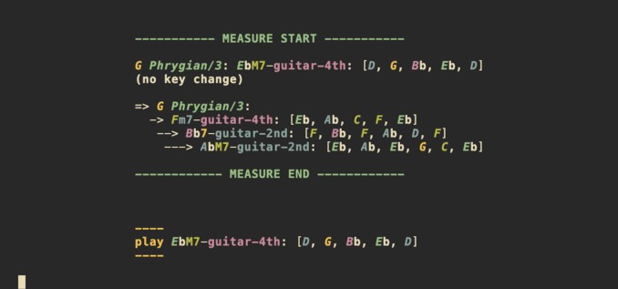

# utrp
  
   
master music and your instrument for fearless composition and improvisation!  
interactive progression trainer for **ALL** harmonic dynamics, [midi](https://wiki.archlinux.org/title/USB_MIDI_keyboards)  
*"u-tr-p" is pronounced like [euterpe](https://en.wikipedia.org/wiki/Euterpe)*

## features
- various modes: piano/keyboard easy/hell and guitar hell
- interactive midi support (arch linux), and live scoring system
- minimum sequence to cover all seventh chord changes with all inversions
- detour to the target chord: (substitute) secondary dominant and all 2-5-1 variants
- all modes and modulations: borrowed mode, shared chords, diminished sevenths crossing

## tutorial
- make it executable and connect midi keyboard to computer if any before running
- select midi input and output by pressing number + enter, if not press enter to skip
- select mode by pressing e/h/g + enter, e/h is for piano, g is equivalent to hell but for guitar
- if a midi is connected, proceed to play the chord suggested as fast as possible
- press enter to skip to the next measure any time
- press q + enter to quit and see the summary