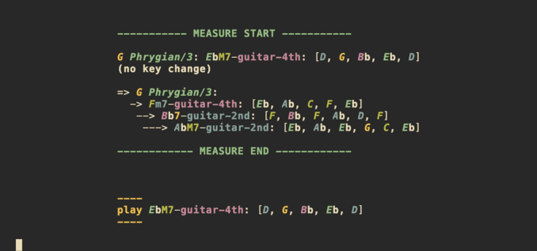

# utrp
  
   
master music and your instrument for fearless composition and improvisation!  
interactive progression trainer for **ALL** harmonic dynamics, [midi](https://wiki.archlinux.org/title/USB_MIDI_keyboards)  
*"u-tr-p" is pronounced like [euterpe](https://en.wikipedia.org/wiki/Euterpe)*

## 十二调图谱 / Major-key atlas

- 十二调竖排：[白底](scripts/major-scales-atlas-mobile.png) · [黑底](scripts/major-scales-atlas-mobile-dark.png)
- 4 × 3 总览：[白底](scripts/major-scales-atlas.png) · [黑底](scripts/major-scales-atlas-dark.png)
- 每调两行：上排五线谱（两列交替，只写音名）＋键盘的整体宽度对应下排第 1–17 品长指板，指板横跨整个下排，而非只放在键盘下方。单调画布宽 1040 px，不再拆成六张指板。歌曲卡片仍保留原有局部把位图。
- 颜色分组不变：1 红、2/3 绿、4/5 鲑鱼色、6/7 蓝；黑底版提亮。配色在 `config/c-major-atlas.toml`。

Regenerate both themes (SVG + PNG; requires `fontTools`, FreeSerif and `rsvg-convert`):

```sh
for theme in light dark; do
  python scripts/render_key_atlas.py --stacked --theme "$theme" --force
  python scripts/render_key_atlas.py --all-keys --theme "$theme" --force
done
for svg in scripts/major-scales-atlas*.svg; do
  rsvg-convert "$svg" -o "${svg%.svg}.png"
done
```

The default is `--theme light`; dark outputs add `-dark` to the filename.
Dark mode inverts piano key colors (natural keys black, raised keys white); geometry and note/degree mappings remain identical.

## 七和弦记忆图 / Seventh-chord atlases

- [键盘图：12 根音 × 5 类七和弦](scripts/seventh-chords-keyboard.png)：maj7、m7、7、m7♭5、dim7；只标和弦音，圆点写音名。
- [指板图：五类七和弦各一个](scripts/seventh-chords-guitar.png)：从上到下 Gmaj7、Am7、D7、F♯m7♭5、Cdim7；图中不写和弦名。1–17 品完整音位，圆点写当前和弦内的级数，而非调内级数。
- 颜色按和弦角色：根音红、三度绿、五度鲑鱼色、七度深蓝；仅独立 dim7 指板使用鲑鱼色／深蓝色交替，两组三全音各自同色。
- 两图均无五线谱、总标题、图例和说明文字；键盘保留和弦名，吉他仅留必要音位标记。沿用现有键盘与指板尺寸，可缩放源文件为同名 SVG。配置：`config/seventh-chords.toml`。
- 黑底版：[键盘](scripts/seventh-chords-keyboard-dark.png) · [吉他](scripts/seventh-chords-guitar-dark.png)；布局与白底版一致，配色使用既有 dark palette，键盘统一反色（白键变黑、黑键变白）。

Regenerate both chord images (SVG + PNG):

```sh
for theme in light dark; do
  python scripts/render_seventh_chords.py --theme "$theme" --force
done
python -m pytest -q tests/test_render_seventh_chords.py
```
