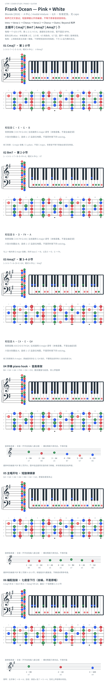

# Frank Ocean — Pink + White

- **版本／调性**：Blonde（2016）；A 中心，混合调式；不等于全曲只用 A major 七音。
- **节拍**：6/8；数 `1-2-3 / 4-5-6`。公开资料有 80／160 BPM 等不同标法，本版不固定速度单位。
- **结构**：Intro → Verse 1 → Chorus → Verse 2 → Chorus → Outro（Beyoncé 和声）。
- **主循环**：`| Cmaj7 | Bm7 | Amaj7 | Amaj7 |`，每格一个 6/8 小节。尾段及 bass 变体未展开。
- **核心线条**：piano hook 骨架 `B4–G4–A4–F#4–D4–E4`（删重复／延音）；主唱开句短摘录 `G4–G4–A4–A4–B4–A4–G4`（句末休止）。

## 图的范围与来源

沿用 `scripts/render_key_atlas.py`：每格是钢琴、高低音五线谱、六个七品指板窗口；下方标品位点，12 品为横向双点。圆环分别定位六根弦上的和弦根音／旋律首音。五线谱调号对应本格背景音集，不是全曲定调。

标准定弦、无 capo；指板从上至下为 1–6 弦（`e B G D A E`），`B8` 为 B 弦第 8 品；`C4` 为中央 C。彩色显示和弦音／旋律音类，各八度均可探索，不是同时按下的指法。旋律格下方另列实音五线谱及原练习路线，圆点等距仅表先后、不表时值。第 6 图是自编连接。

- 和声与 6/8：[Ethan Hein 分析](https://www.ethanhein.com/wp/2017/frank-ocean-pink-and-white/)、[Noise Chest 重制](https://noisechest.com/articles/frank-ocean-pink-white)。前三个和弦已交叉核对；Amaj7 上的 G／G# 层间色彩不能抹平。
- 段落：[L. Greenhalgh rhythm-section 转录](https://www.scribd.com/document/670266412/Pink-White)；本版只用其段落概览，不复制完整谱。
- 短旋律：[公开 piano 改编谱](https://soundreasonstudio.com/MuseScore-Library-msv3-041119/Repertoire/Pink%20Plus%20White.pdf)，PDF 第 2 页：开头与第 9–10 小节。已视觉核对音符；吉他位置由标准定弦独立复算。

**状态（2026-10-04）**：资料版样板，未对原录音逐音听核；不是官方谱。TOML 是图的数据源。

## 复核记录（2026-10-04）

重新视觉核对公开 piano PDF 第 2 页开头与第 9–10 小节，短摘录音高相符；Ethan Hein 支持主循环及 6/8。未听核原录音，段落概览未独立重验。

本轮检查了数据、音高/弦品及可取得的引用内容；未逐段听核原录音，发行曲目归属核对不等于录音版本及完整演职员表已核验。图中的自编逐卡选音不保证最短声部连接，卡序不等于原曲进行。

## 曲目信息复核

已对照所列发行曲目表核对主艺人、曲名与所属专辑；不是完整演职员表，也不证明所用谱对应特定录音版本。

- [曲目信息来源 1](https://music.apple.com/us/album/blonde/1146195596)
