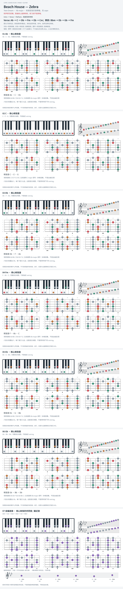

# Beach House — Zebra

- 专辑：Teen Dream；工作调性：**Ab major**。
- 值得扒：大 III 与借用 bVII。
- 状态：和声研究初稿；原曲核心旋律待核，练习线不是原唱。

## 结构与进行

Intro → Verse → Refrain；局部变体待核。

`Verse: Ab → C → Db → Fm → Eb → Cm；转折: Bbm → Eb → Gb → Fm`

C 大和弦带 E natural，不是 Cm；Gb 带 Gb 而非 G，两处需要局部音集切换。

## 核心旋律

**待核**：本轮尚未取得并核验逐音主旋律谱；图中自编拆和弦练习不替代原曲核心旋律。

七品 × 六把位；下方品位点；钢琴与高低音五线谱。标准定弦、实音显示。灰色七声音集是本格教学背景，不是整首歌的唯一音阶；彩色点是音位而非同时按下的 voicing。

## 来源与限制

- [参考 1](https://ukutabs.com/b/beach-house/zebra/)

按公开谱例/文字分析整理，未声称已听辨原录音或看完视频。没有复制歌词或完整商业谱。
