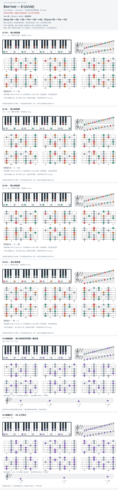

# Bon Iver — 8 (circle)

- 专辑：22, A Million；工作调性：**Ab major**。
- 值得扒：长旋律跨循环与 IV–vi–V 张力。
- 状态：和声研究初稿；原曲核心旋律待核，练习线不是原唱。

## 结构与进行

Verse 组 → Chorus → Verse → 叠唱尾段。

`Verse: Db → Ab → Eb → Fm → Db → Ab；Chorus: Db → Fm → Eb`

出版谱原调 Ab；所引 A 调简谱下移半音还原出版调，不是为填榜任意移调。

## 核心旋律

**待核**：本轮尚未取得并核验逐音主旋律谱；图中自编拆和弦练习不替代原曲核心旋律。

七品 × 六把位；下方品位点；钢琴与高低音五线谱。标准定弦、实音显示。灰色七声音集是本格教学背景，不是整首歌的唯一音阶；彩色点是音位而非同时按下的 voicing。

## 来源与限制

- [参考 1](https://www.musicnotes.com/sheetmusic/bon-iver/8-circle/MN0189856)
- [参考 2](https://www.cifraclub.com/bon-iver/8-circle/)

按公开谱例/文字分析整理，未声称已听辨原录音或看完视频。没有复制歌词或完整商业谱。
