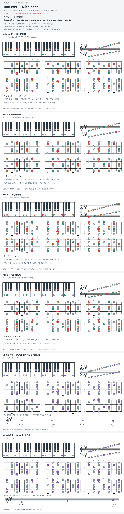

# Bon Iver — Michicant

- 专辑：Bon Iver, Bon Iver；工作调性：**Ab major 待核**。
- 值得扒：add9 持续音与叙事长句。
- 状态：和声研究初稿；原曲核心旋律待核，练习线不是原唱。

## 结构与进行

三组 Verse → 尾句落主和弦。

`参考谱换算: Dbadd9 → Ab → Fm → Eb → Dbadd9 → Ab → Dbadd9`

参考和弦页为 G 指型；按原调资料上移半音至 Ab。该音高换算仍需录音复核。

## 核心旋律

**待核**：本轮尚未取得并核验逐音主旋律谱；图中自编拆和弦练习不替代原曲核心旋律。

七品 × 六把位；下方品位点；钢琴与高低音五线谱。标准定弦、实音显示。灰色七声音集是本格教学背景，不是整首歌的唯一音阶；彩色点是音位而非同时按下的 voicing。

## 来源与限制

- [参考 1](https://www.e-chords.com/chords/bon-iver/michicant)
- [参考 2](https://singingcarrots.com/song?song=bon-iver-michicant)

按公开谱例/文字分析整理，未声称已听辨原录音或看完视频。没有复制歌词或完整商业谱。
