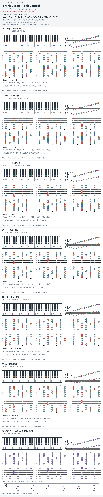

# Frank Ocean — Self Control

- 专辑：Blonde；工作调性：**Ab major**。
- 值得扒：ii–V–I 与混合调式 Outro。
- 状态：和声研究初稿；原曲核心旋律待核，练习线不是原唱。

## 结构与进行

Intro → Verse → Hook → Solo → Outro。

`Verse: Abmaj7 → Fm7 → Bbm7 → Eb7；Outro 另有 Cm7 / Gb 色彩`

capo 1 的 G 指型已换算实音；Gb 卡仅画三和弦核心，来源 Gb13 的全部延伸尚未纳入。

## 核心旋律

**待核**：本轮尚未取得并核验逐音主旋律谱；图中自编拆和弦练习不替代原曲核心旋律。

七品 × 六把位；下方品位点；钢琴与高低音五线谱。标准定弦、实音显示。灰色七声音集是本格教学背景，不是整首歌的唯一音阶；彩色点是音位而非同时按下的 voicing。

## 来源与限制

- [参考 1](https://www.chords-and-tabs.net/song/name/frank-ocean-self-control-3)
- [参考 2](https://janeway.uncpress.org/capstone/article/3366/galley/3409/download/)

按公开谱例/文字分析整理，未声称已听辨原录音或看完视频。没有复制歌词或完整商业谱。
