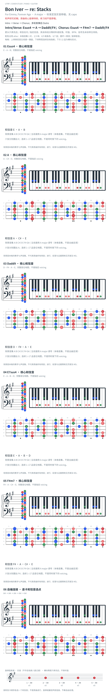

# Bon Iver — re: Stacks

- 专辑：For Emma, Forever Ago；工作调性：**A major**。
- 值得扒：悬挂音与开放定弦的声部连接。
- 状态：和声研究初稿；原曲核心旋律待核，练习线不是原唱。

## 结构与进行

Intro → Verse → Chorus；多轮叙事后 Outro。

`Intro/Verse: Esus4 → A → Dadd9/F#；Chorus: Esus4 → F#m7 → Dadd9/F#`

图为标准定弦实音移植，不是 Open D 原始指型；现场不同 capo 版本不可混用。 这里只列段落骨架，Intro 的 E7sus4、Gadd9/E 等变化未展开。

## 核心旋律

**待核**：本轮尚未取得并核验逐音主旋律谱；图中自编拆和弦练习不替代原曲核心旋律。

七品 × 六把位；下方品位点；钢琴与高低音五线谱。标准定弦、实音显示。箭头只表先后；和弦名内 / 指定低音，其余斜线分隔材料或段落。时值、BPM、拍号及未标转位待核。灰色七声音集是本格教学背景，不是整首歌的唯一音阶；彩色点是音位而非同时按下的 voicing。

## 来源与限制

- [参考 1](https://vchords.com/en/chords/bon-iver/re-stacks-5825)
- [参考 2](https://api.musicnotes.com/sheetmusic/bon-iver/re-stacks/MN0098562)

按公开谱例/文字分析整理，未声称已听辨原录音或看完视频。没有复制歌词或完整商业谱。

## 复核记录（2026-10-04）

VChords 的 Chorus 保留 Dadd9/F#；已改正原来的 D 简写。页面版本与原录音定弦/capo 仍需对齐，Gadd9/E 等局部变化未展开。

本轮检查了数据、音高/弦品及可取得的引用内容；未逐段听核原录音，发行曲目归属核对不等于录音版本及完整演职员表已核验。图中的自编逐卡选音不保证最短声部连接，卡序不等于原曲进行。

## 曲目信息复核

已对照所列发行曲目表核对主艺人、曲名与所属专辑；不是完整演职员表，也不证明所用谱对应特定录音版本。

- [曲目信息来源 1](https://boniver.org/audio/for-emma-forever-ago/)
