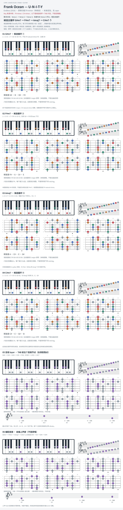

# Frank Ocean — U-N-I-T-Y

- **版本／调性**：Endless 曲目；和弦参考页面标作 CDQ，未与 2016 视觉版逐段对齐。文件名沿用原表 F♯ minor，并加 `pending`，不是已确认原调。
- **速度／节拍**：BPM 待核；4/4 仅作本版练习网格，原曲时值待核。
- **结构**：歌词分 Verse 1 → Verse 2 → Verse 3；标题句在 Verse 3 开头。尾段暂不展开。
- **候选循环**：`G#m7 → F#m7 → Amaj7 → C#m7`；可先每和弦 4 拍试奏，此时值为自定练习，不是转录结果。
- **核心器乐线条**：吉他 layer 短摘录 `G#4–C#5–G#4–C#5–F#4`，B 弦 `9 → 14\9 → 14\7`。人声 hook 缺可靠音高转录，本版不填猜测音符。

## 图的范围与来源

沿用 `scripts/render_key_atlas.py`：每格是钢琴、高低音五线谱、六个七品指板窗口；下方标品位点，12 品为横向双点。圆环分别定位六根弦上的和弦根音／旋律首音。五线谱调号对应本格背景音集，不是已确认的全曲调号。

标准定弦、无 capo；指板从上至下为 1–6 弦（`e B G D A E`），`B9` 为 B 弦第 9 品；`C4` 为中央 C。灰色是练习背景，彩色显示和弦音／旋律音类，各八度均可探索，不是同时按下的 voicing。旋律格下方另列实音五线谱及原 TAB 路线，圆点等距仅表先后、不表时值；原 TAB 的 7→14 品范围跨窗口查看，不删改滑音来凑七品。第 6 图是自编连接。

- **Key 冲突**：[GetSongKey](https://getsongkey.com/album/endless/NnMA2) 标 F♯ minor；[Chordify 的 CDQ 页面](https://chordify.net/chords/frank-ocean-songs/unity-chords) 标 C♯ minor，并给出上述主循环。图中取其候选核心和弦，不采信全部自动识别的过渡和弦。
- **音集说明（分析）**：这些和弦可共用 `E F# G# A B C# D#`；其中 D♯ 不属于 F♯ natural minor。不能据和弦音集直接判定主音，也不为保住原分组把 D♯ 改成 D。
- **短旋律**：[公开用户 TAB](https://www.chords-and-tabs.net/song/name/frank-ocean-unity)，仅取前五个音高节点（含滑音落点），不还原滑音连续音高；已按定弦复算为上述音高，尚未听核原录音。
- **段落**：[歌词分段](https://songsear.ch/song/Frank-Ocean/U-N-I-T-Y/2020093)；歌词段落不等于已核定的和声段落。

**状态（2026-10-04）**：待核验样板；缺原录音逐段核对、人声 hook 音高与准确时值。TOML 是图的数据源。

## 复核记录（2026-10-04）

用户 TAB 开头 B9/B14/B9/B14/B7 换算为 G#4/C#5/G#4/C#5/F#4；候选循环来自自动识别，不能凭 TAB 确認。移除未复核的约 70 BPM，调性及歌词分段仍待核。

本轮检查了数据、音高/弦品及可取得的引用内容；未逐段听核原录音，发行曲目归属核对不等于录音版本及完整演职员表已核验。图中的自编逐卡选音不保证最短声部连接，卡序不等于原曲进行。

## 曲目信息复核

Apple Music 官方页面确认 Frank Ocean 的 Endless 视觉专辑；分曲归属由 Metacritic 与 The Independent 发布资料交叉支持，未读取官方片尾逐曲 credits，视觉版与 CDQ 编配仍须区别。

- [曲目信息来源 1](https://music.apple.com/us/music-video/endless/1143705097)
- [曲目信息来源 2](https://www.metacritic.com/music/endless/frank-ocean/details)
- [曲目信息来源 3](https://www.the-independent.com/arts-entertainment/music/news/frank-ocean-new-album-endless-tracklist-full-credits-features-james-blake-jonny-greenwood-sampha-a7198641.html)
