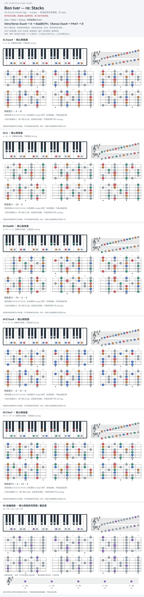

# Bon Iver — re: Stacks

- 专辑：For Emma, Forever Ago；工作调性：**A major**。
- 值得扒：悬挂音与开放定弦的声部连接。
- 状态：和声研究初稿；原曲核心旋律待核，练习线不是原唱。

## 结构与进行

Intro → Verse → Chorus；多轮叙事后 Outro。

`Intro/Verse: Esus4 → A → Dadd9/F#；Chorus: Esus4 → F#m7 → D`

图为标准定弦实音移植，不是 Open D 原始指型；现场不同 capo 版本不可混用。

## 核心旋律

**待核**：本轮尚未取得并核验逐音主旋律谱；图中自编拆和弦练习不替代原曲核心旋律。

七品 × 六把位；下方品位点；钢琴与高低音五线谱。标准定弦、实音显示。灰色七声音集是本格教学背景，不是整首歌的唯一音阶；彩色点是音位而非同时按下的 voicing。

## 来源与限制

- [参考 1](https://vchords.com/en/chords/bon-iver/re-stacks-5825)
- [参考 2](https://api.musicnotes.com/sheetmusic/bon-iver/re-stacks/MN0098562)

按公开谱例/文字分析整理，未声称已听辨原录音或看完视频。没有复制歌词或完整商业谱。
