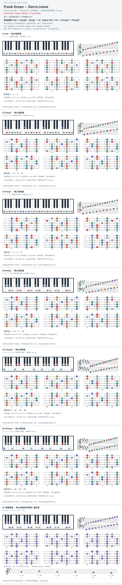

# Frank Ocean — Sierra Leone

- 专辑：Channel Orange；工作调性：**A Mixolydian / 多调待核**。
- 值得扒：平行大小色彩与 Outro 调域改变。
- 原表：G / Em · G major（保留追踪，不代表正确）。
- 状态：和声研究初稿；原曲核心旋律待核，练习线不是原唱。

## 结构与进行

开头 → 混合调式主段 → 不同音集 Outro。

`主段材料: Am → Gmaj7；Amaj7 → G；Outro: D9 → F# → C#maj7 → F#maj7`

原表 G 不等于实际 A 中心；Mixolydian 的音集也不等于 D major 的功能。暂存 A 目录但不上榜，避免硬塞进相对调组。

## 核心旋律

**待核**：本轮尚未取得并核验逐音主旋律谱；图中自编拆和弦练习不替代原曲核心旋律。

七品 × 六把位；下方品位点；钢琴与高低音五线谱。标准定弦、实音显示。灰色七声音集是本格教学背景，不是整首歌的唯一音阶；彩色点是音位而非同时按下的 voicing。

## 来源与限制

- [参考 1](https://www.e-chords.com/chords/frank-ocean/sierra-leone)
- [参考 2](https://www.hooktheory.com/theorytab/view/frank-ocean/sierra-leone)

按公开谱例/文字分析整理，未声称已听辨原录音或看完视频。没有复制歌词或完整商业谱。
