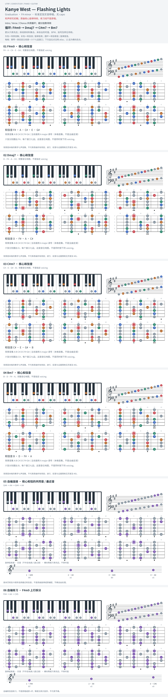

# Kanye West — Flashing Lights

- 专辑：Graduation；工作调性：**F# minor**。
- 值得扒：九度主和弦与下行七和弦。
- 原表：Gb / Ebm · F# major（保留追踪，不代表正确）。
- 状态：和声研究初稿；原曲核心旋律待核，练习线不是原唱。

## 结构与进行

Intro / Verse / Chorus 共用循环；细分拍数待核。

`循环: F#m9 → Dmaj7 → C#m7 → Bm7`

原表 F# major 与参考谱冲突；此处 F# minor 与 A major 同组，不是 Gb major 组。

## 核心旋律

**待核**：本轮尚未取得并核验逐音主旋律谱；图中自编拆和弦练习不替代原曲核心旋律。

七品 × 六把位；下方品位点；钢琴与高低音五线谱。标准定弦、实音显示。灰色七声音集是本格教学背景，不是整首歌的唯一音阶；彩色点是音位而非同时按下的 voicing。

## 来源与限制

- [参考 1](https://www.supersimplepiano.com/player/flashing-lights-49537765756569607)

按公开谱例/文字分析整理，未声称已听辨原录音或看完视频。没有复制歌词或完整商业谱。
