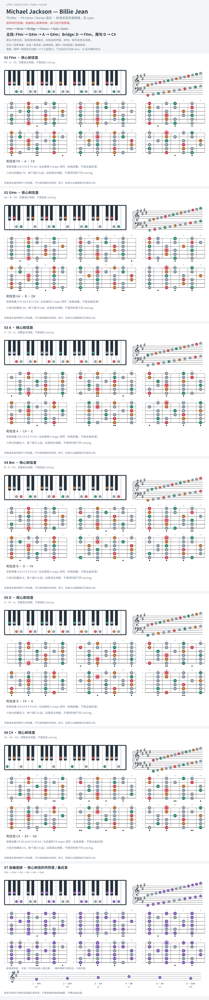

# Michael Jackson — Billie Jean

- 专辑：Thriller；工作调性：**F# minor / Dorian 混合**。
- 值得扒：bass ostinato 与调式混用。
- 原表：A / F#m · F# minor（保留追踪，不代表正确）。
- 状态：和声研究初稿；原曲核心旋律待核，练习线不是原唱。

## 结构与进行

Intro → Verse → Bridge → Chorus → Solo / Outro。

`主段: F#m → G#m → A → G#m；Bridge: D → F#m，尾句 D → C#`

按教学谱的 F# 中心归组；G#m 含 D#，Bm / D 含 D natural。原录音有调谐偏移，不等于另一半音调。

## 核心旋律

**待核**：本轮尚未取得并核验逐音主旋律谱；图中自编拆和弦练习不替代原曲核心旋律。

七品 × 六把位；下方品位点；钢琴与高低音五线谱。标准定弦、实音显示。灰色七声音集是本格教学背景，不是整首歌的唯一音阶；彩色点是音位而非同时按下的 voicing。

## 来源与限制

- [参考 1](https://spytunes.com/billie-jean-chords/)

按公开谱例/文字分析整理，未声称已听辨原录音或看完视频。没有复制歌词或完整商业谱。
