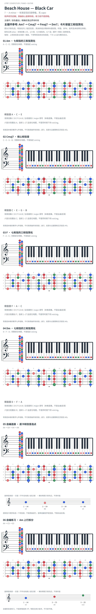

# Beach House — Black Car

- 专辑：7；工作调性：**A minor**。
- 值得扒：小调循环中的共通音。
- 原表：C / Am · A minor（保留追踪，不代表正确）。
- 状态：和声研究初稿；原曲核心旋律待核，练习线不是原唱。

## 结构与进行

主循环 / 音色叠加；精确段落边界待听核。

`主循环参考: Am7 → Cmaj7 → Fmaj7 → Dm7；卡片保留三和弦简化`

Reddit 翻弹者给三和弦简化；Reverb Machine 重制分析补出 Am7/Cmaj7/Fmaj7/Dm7，每和弦两小节。此处三和弦卡与 Am 练习不代表完整 organ/bass 和声，synth ostinato 待核。

## 核心旋律

**待核**：本轮尚未取得并核验逐音主旋律谱；图中自编拆和弦练习不替代原曲核心旋律。

七品 × 六把位；下方品位点；钢琴与高低音五线谱。标准定弦、实音显示。箭头只表先后；和弦名内 / 指定低音，其余斜线分隔材料或段落。时值、BPM、拍号及未标转位待核。灰色七声音集是本格教学背景，不是整首歌的唯一音阶；彩色点是音位而非同时按下的 voicing。

## 来源与限制

- [参考 1](https://www.reddit.com/r/BeachHouse/comments/15xde9o)

按公开谱例/文字分析整理，未声称已听辨原录音或看完视频。没有复制歌词或完整商业谱。

- [复核补充来源](https://reverbmachine.com/blog/how-beach-house-created-black-car/)

## 复核记录（2026-10-04）

新增 Reverb Machine 作者重制分析，其 organ/bass 主循环是 Am7/Cmaj7/Fmaj7/Dm7；原三和弦卡仅作为简化，不能抹去七度层。未听核 synth ostinato。

本轮检查了数据、音高/弦品及可取得的引用内容；未逐段听核原录音，发行曲目归属核对不等于录音版本及完整演职员表已核验。图中的自编逐卡选音不保证最短声部连接，卡序不等于原曲进行。

## 曲目信息复核

已对照所列发行曲目表核对主艺人、曲名与所属专辑；不是完整演职员表，也不证明所用谱对应特定录音版本。

- [曲目信息来源 1](https://www.subpop.com/releases/beach_house/7)
