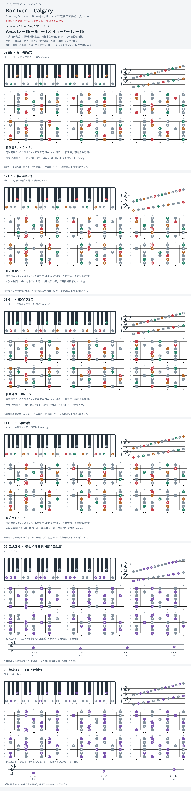

# Bon Iver — Calgary

- 专辑：Bon Iver, Bon Iver；工作调性：**Bb major / Gm**。
- 值得扒：相对大小调重心与声部层次。
- 状态：和声研究初稿；原曲核心旋律待核，练习线不是原唱。

## 结构与进行

Verse 组 → Bridge: Gm / F / Eb → 尾段。

`Verse: Eb → Bb → Gm → Bb；Gm → F → Eb → Bb`

capo 3 的 G 指型换算为 Bb 实音；不是图上仍按 capo 相对品数弹。

## 核心旋律

**待核**：本轮尚未取得并核验逐音主旋律谱；图中自编拆和弦练习不替代原曲核心旋律。

七品 × 六把位；下方品位点；钢琴与高低音五线谱。标准定弦、实音显示。灰色七声音集是本格教学背景，不是整首歌的唯一音阶；彩色点是音位而非同时按下的 voicing。

## 来源与限制

- [参考 1](https://www.e-chords.com/chords/bon-iver/calgary)
- [参考 2](https://www.supersimplepiano.com/how-to-play/calgary-897528619382331793)

按公开谱例/文字分析整理，未声称已听辨原录音或看完视频。没有复制歌词或完整商业谱。
