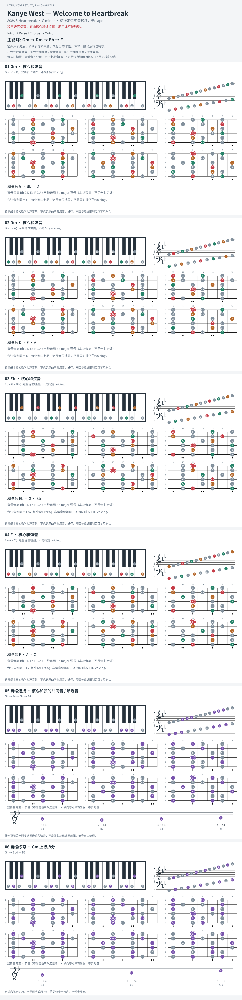

# Kanye West — Welcome to Heartbreak

- 专辑：808s & Heartbreak；工作调性：**G minor**。
- 值得扒：小调 i–v–VI–VII 与简短旋律动机。
- 原表：G / Em · G major（保留追踪，不代表正确）。
- 状态：和声研究初稿；原曲核心旋律待核，练习线不是原唱。

## 结构与进行

Intro → Verse / Chorus → Outro。

`主循环: Gm → Dm → Eb → F`

原表 G major 错分；来源 bass 为 Drop D，本页只用标准定弦的和声地图。

## 核心旋律

**待核**：本轮尚未取得并核验逐音主旋律谱；图中自编拆和弦练习不替代原曲核心旋律。

七品 × 六把位；下方品位点；钢琴与高低音五线谱。标准定弦、实音显示。灰色七声音集是本格教学背景，不是整首歌的唯一音阶；彩色点是音位而非同时按下的 voicing。

## 来源与限制

- [参考 1](https://www.khmerchords.com/en/kanye-west/welcome-to-heartbreak)
- [参考 2](https://www.hooktheory.com/theorytab/view/kanye-west/welcome-to-heartbreak)

按公开谱例/文字分析整理，未声称已听辨原录音或看完视频。没有复制歌词或完整商业谱。
