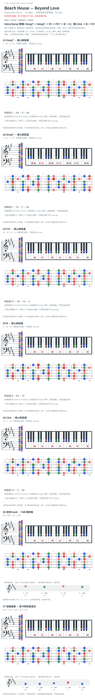

# Beach House — Beyond Love

- 专辑：Depression Cherry；工作调性：**B major**。
- 值得扒：借用 bVIImaj7 与吉他半音 hook。
- 状态：和声研究初稿；短 riff 据公开 TAB，尚未逐音听核。

## 结构与进行

Intro → Verse → Refrain → Outro。

`Intro/Verse 骨架: Emaj7 → Amaj7 → F# → F#7 → B → E；接 C#m → B → F#7 → B → E`

采用 Cifra Club 的较细和声谱；早期简化 TAB 省略若干色彩和弦，hook 摘录单独标源。 主段省略 Bsus4/C#m9 等变化；旧 ChordLines 链接本轮不可读，短 hook 改据 E-Chords TAB。

## 核心旋律

已附短 riff 摘录；不是整曲主唱旋律，节奏仍请对照来源。

七品 × 六把位；下方品位点；钢琴与高低音五线谱。标准定弦、实音显示。箭头只表先后；和弦名内 / 指定低音，其余斜线分隔材料或段落。时值、BPM、拍号及未标转位待核。灰色七声音集是本格教学背景，不是整首歌的唯一音阶；彩色点是音位而非同时按下的 voicing。

## 来源与限制

- [参考 1](https://www.cifraclub.com/beach-house/beyond-love/)
- [参考 2](https://www.chordlines.com/beach-house/beyond-love)

按公开谱例/文字分析整理，未声称已听辨原录音或看完视频。没有复制歌词或完整商业谱。

- [复核补充来源](https://www.e-chords.com/tabs/beach-house/beyond-love)

## 复核记录（2026-10-04）

Cifra Club 的 Intro 与 Verse 共用所列材料，骨架省略 Bsus4/C#m9 等细节；另对照 E-Chords TAB 顶弦 12/11/12/11，支持所摘四音。未听核原录音。

本轮检查了数据、音高/弦品及可取得的引用内容；未逐段听核原录音，发行曲目归属核对不等于录音版本及完整演职员表已核验。图中的自编逐卡选音不保证最短声部连接，卡序不等于原曲进行。

## 曲目信息复核

已对照所列发行曲目表核对主艺人、曲名与所属专辑；不是完整演职员表，也不证明所用谱对应特定录音版本。

- [曲目信息来源 1](https://www.subpop.com/releases/beach_house/depression_cherry)
