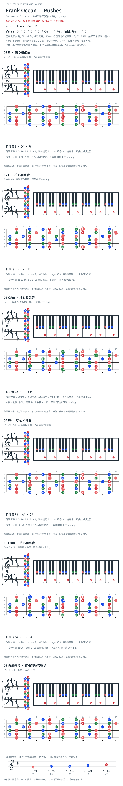

# Frank Ocean — Rushes

- 专辑：Endless；工作调性：**B major**。
- 值得扒：I–IV 与 ii–V 的空间感。
- 原表：B / G#m · B major（保留追踪，不代表正确）。
- 状态：和声研究初稿；原曲核心旋律待核，练习线不是原唱。

## 结构与进行

Verse → Chorus → Outro: B。

`Verse: B → E → B → E → C#m → F#；后段: G#m → E`

参考谱 F# → F → E 半音段的 F 和弦性质不确定，未把它自动当作 F 大和弦绘制。

## 核心旋律

**待核**：本轮尚未取得并核验逐音主旋律谱；图中自编拆和弦练习不替代原曲核心旋律。

七品 × 六把位；下方品位点；钢琴与高低音五线谱。标准定弦、实音显示。箭头只表先后；和弦名内 / 指定低音，其余斜线分隔材料或段落。时值、BPM、拍号及未标转位待核。灰色七声音集是本格教学背景，不是整首歌的唯一音阶；彩色点是音位而非同时按下的 voicing。

## 来源与限制

- [参考 1](https://www.guitartabsexplorer.com/ocean-frank/rushes-chords)

按公开谱例/文字分析整理，未声称已听辨原录音或看完视频。没有复制歌词或完整商业谱。

## 复核记录（2026-10-04）

GuitarTabsExplorer 支持 B/E/C#m/F#；来源中 F 的性质仍可疑，保留候选警告，未宣称每个过渡和弦准确。

本轮检查了数据、音高/弦品及可取得的引用内容；未逐段听核原录音，发行曲目归属核对不等于录音版本及完整演职员表已核验。图中的自编逐卡选音不保证最短声部连接，卡序不等于原曲进行。

## 曲目信息复核

Apple Music 官方页面确认 Frank Ocean 的 Endless 视觉专辑；分曲归属由 Metacritic 与 The Independent 发布资料交叉支持，未读取官方片尾逐曲 credits，视觉版与 CDQ 编配仍须区别。

- [曲目信息来源 1](https://music.apple.com/us/music-video/endless/1143705097)
- [曲目信息来源 2](https://www.metacritic.com/music/endless/frank-ocean/details)
- [曲目信息来源 3](https://www.the-independent.com/arts-entertainment/music/news/frank-ocean-new-album-endless-tracklist-full-credits-features-james-blake-jonny-greenwood-sampha-a7198641.html)
