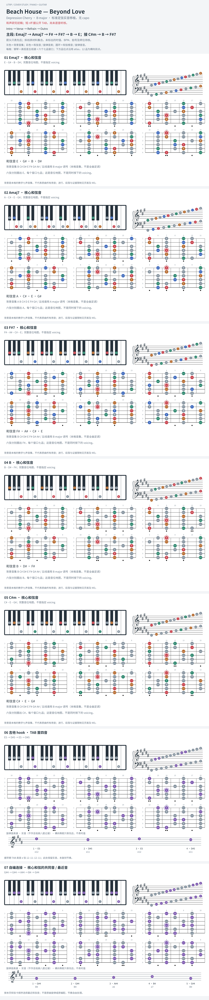

# Beach House — Beyond Love

- 专辑：Depression Cherry；工作调性：**B major**。
- 值得扒：借用 bVIImaj7 与吉他半音 hook。
- 状态：和声研究初稿；短 riff 据公开 TAB，尚未逐音听核。

## 结构与进行

Intro → Verse → Refrain → Outro。

`主段: Emaj7 → Amaj7 → F# → F#7 → B → E；接 C#m → B → F#7`

采用 Cifra Club 的较细和声谱；早期简化 TAB 省略若干色彩和弦，hook 摘录单独标源。

## 核心旋律

已附短 riff 摘录；不是整曲主唱旋律，节奏仍请对照来源。

七品 × 六把位；下方品位点；钢琴与高低音五线谱。标准定弦、实音显示。灰色七声音集是本格教学背景，不是整首歌的唯一音阶；彩色点是音位而非同时按下的 voicing。

## 来源与限制

- [参考 1](https://www.cifraclub.com/beach-house/beyond-love/)
- [参考 2](https://www.chordlines.com/beach-house/beyond-love)

按公开谱例/文字分析整理，未声称已听辨原录音或看完视频。没有复制歌词或完整商业谱。
