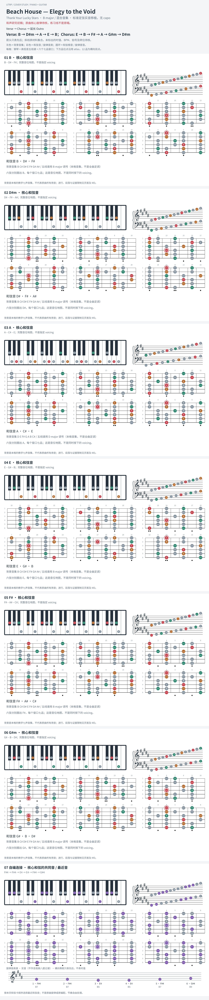

# Beach House — Elegy to the Void

- 专辑：Thank Your Lucky Stars；工作调性：**B major / 混合音集**。
- 值得扒：借用 bVII 与 iii–vi 的暗色。
- 状态：和声研究初稿；原曲核心旋律待核，练习线不是原唱。

## 结构与进行

Verse → Chorus → 延长 Outro。

`Verse: B → D#m → A → E → B；Chorus: E → B → F# → A → G#m → D#m`

capo 2 的 A 指型已换算 B 实音；Chorus 尾部另有 D# / G# 大和弦，未在六个核心卡展开。

## 核心旋律

**待核**：本轮尚未取得并核验逐音主旋律谱；图中自编拆和弦练习不替代原曲核心旋律。

七品 × 六把位；下方品位点；钢琴与高低音五线谱。标准定弦、实音显示。灰色七声音集是本格教学背景，不是整首歌的唯一音阶；彩色点是音位而非同时按下的 voicing。

## 来源与限制

- [参考 1](https://www.e-chords.com/chords/beach-house/elegy-to-the-void)

按公开谱例/文字分析整理，未声称已听辨原录音或看完视频。没有复制歌词或完整商业谱。
