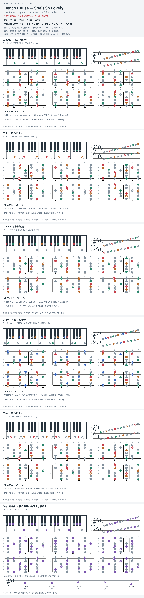

# Beach House — She's So Lovely

- 专辑：Thank Your Lucky Stars；工作调性：**G# minor**。
- 值得扒：属七与 bII 的小调张力。
- 状态：和声研究初稿；原曲核心旋律待核，练习线不是原唱。

## 结构与进行

Intro → Verse → 对比段 → Verse → Outro。

`Verse: G#m → E → F# → G#m；对比: E → D#7；A → G#m`

D#7 的三音为 Fx；卡片等音重拼 Eb7，避免误写 F#。A 是 bII 色彩，不能当作调内和弦。

## 核心旋律

**待核**：本轮尚未取得并核验逐音主旋律谱；图中自编拆和弦练习不替代原曲核心旋律。

七品 × 六把位；下方品位点；钢琴与高低音五线谱。标准定弦、实音显示。灰色七声音集是本格教学背景，不是整首歌的唯一音阶；彩色点是音位而非同时按下的 voicing。

## 来源与限制

- [参考 1](https://www.e-chords.com/chords/beach-house/shes-so-lovely)

按公开谱例/文字分析整理，未声称已听辨原录音或看完视频。没有复制歌词或完整商业谱。
