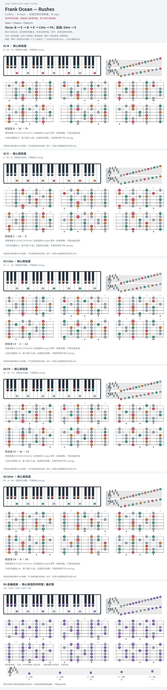

# Frank Ocean — Rushes

- 专辑：Endless；工作调性：**B major**。
- 值得扒：I–IV 与 ii–V 的空间感。
- 原表：B / G#m · B major（保留追踪，不代表正确）。
- 状态：和声研究初稿；原曲核心旋律待核，练习线不是原唱。

## 结构与进行

Verse → Chorus → Outro: B。

`Verse: B → E → B → E → C#m → F#；后段: G#m → E`

参考谱 F# → F → E 半音段的 F 和弦性质不确定，未把它自动当作 F 大和弦绘制。

## 核心旋律

**待核**：本轮尚未取得并核验逐音主旋律谱；图中自编拆和弦练习不替代原曲核心旋律。

七品 × 六把位；下方品位点；钢琴与高低音五线谱。标准定弦、实音显示。灰色七声音集是本格教学背景，不是整首歌的唯一音阶；彩色点是音位而非同时按下的 voicing。

## 来源与限制

- [参考 1](https://www.guitartabsexplorer.com/ocean-frank/rushes-chords)

按公开谱例/文字分析整理，未声称已听辨原录音或看完视频。没有复制歌词或完整商业谱。
