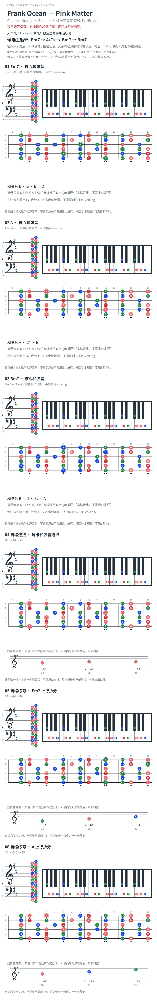

# Frank Ocean — Pink Matter

- 专辑：Channel Orange；工作调性：**B minor**。
- 值得扒：iv–VII–i 的小调落点（相对 D 为 ii–V–vi）。
- 原表：D / Bm · B minor（保留追踪，不代表正确）。
- 状态：和声研究初稿；原曲核心旋律待核，练习线不是原唱。

## 结构与进行

人声段 / André 3000 段；段落边界待录音核对。

`候选主循环: Em7 → A/C# → Bm7 → Bm7`

已从搜索索引取得原 Reddit 作者的 Em7/A-C#/Bm7 候选；未听核原录音。按 B minor 分析为 iv7–VII6–i7，而非 ii–V；A 卡不表示根音低音，C# bass 需另弹。

## 核心旋律

**待核**：本轮尚未取得并核验逐音主旋律谱；图中自编拆和弦练习不替代原曲核心旋律。

七品 × 六把位；下方品位点；钢琴与高低音五线谱。标准定弦、实音显示。箭头只表先后；和弦名内 / 指定低音，其余斜线分隔材料或段落。时值、BPM、拍号及未标转位待核。灰色七声音集是本格教学背景，不是整首歌的唯一音阶；彩色点是音位而非同时按下的 voicing。

## 来源与限制

- [参考 1](https://www.reddit.com/r/FrankOcean/comments/1750oas)
- [参考 2](https://www.chords-and-tabs.net/song/name/frank-ocean-pink-matter)

按公开谱例/文字分析整理，未声称已听辨原录音或看完视频。没有复制歌词或完整商业谱。

## 复核记录（2026-10-04）

搜索索引恢复原 Reddit 作者的 Em7→A/C#→Bm7→Bm7 描述，支持候选来源但不等于原录音认证。按 B minor 分析为 iv7–VII6–i7；相对 D 才可称 ii–V–vi。

本轮检查了数据、音高/弦品及可取得的引用内容；未逐段听核原录音，发行曲目归属核对不等于录音版本及完整演职员表已核验。图中的自编逐卡选音不保证最短声部连接，卡序不等于原曲进行。

## 曲目信息复核

已对照所列发行曲目表核对主艺人、曲名与所属专辑；不是完整演职员表，也不证明所用谱对应特定录音版本。

- [曲目信息来源 1](https://music.apple.com/us/album/channel-orange/1440765580)
