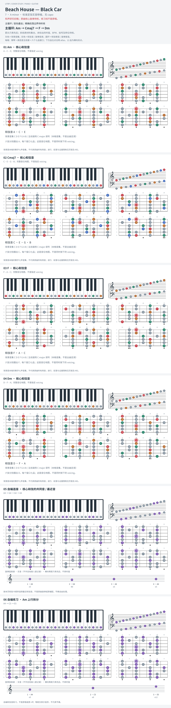

# Beach House — Black Car

- 专辑：7；工作调性：**A minor**。
- 值得扒：小调循环中的共通音。
- 原表：C / Am · A minor（保留追踪，不代表正确）。
- 状态：和声研究初稿；原曲核心旋律待核，练习线不是原唱。

## 结构与进行

主循环 / 音色叠加；精确段落边界待听核。

`主循环: Am → Cmaj7 → F → Dm`

和弦据翻弹者描述；尚未逐音核对 synth ostinato。

## 核心旋律

**待核**：本轮尚未取得并核验逐音主旋律谱；图中自编拆和弦练习不替代原曲核心旋律。

七品 × 六把位；下方品位点；钢琴与高低音五线谱。标准定弦、实音显示。灰色七声音集是本格教学背景，不是整首歌的唯一音阶；彩色点是音位而非同时按下的 voicing。

## 来源与限制

- [参考 1](https://www.reddit.com/r/BeachHouse/comments/15xde9o)

按公开谱例/文字分析整理，未声称已听辨原录音或看完视频。没有复制歌词或完整商业谱。
