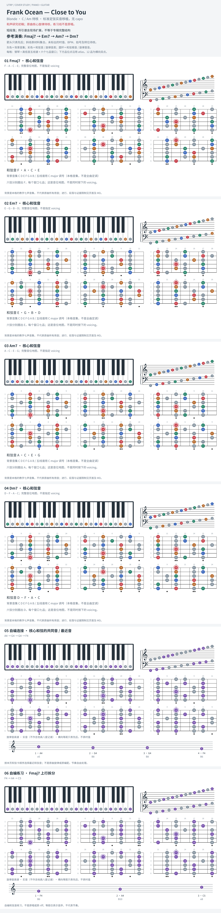

# Frank Ocean — Close to You

- 专辑：Blonde；工作调性：**C / Am 待核**。
- 值得扒：下降七和弦与采样式短句。
- 原表：Bb / Gm · Bb major（保留追踪，不代表正确）。
- 状态：和声研究初稿；原曲核心旋律待核，练习线不是原唱。

## 结构与进行

短段落；所引谱含现场扩展，不等于专辑完整结构。

`参考演奏: Fmaj7 → Em7 → Am7 → Dm7`

原表 Bb 与所引谱冲突；此处是参考演奏的 C/Am 材料，Blonde 音频调性和主旋律仍待核。

## 核心旋律

**待核**：本轮尚未取得并核验逐音主旋律谱；图中自编拆和弦练习不替代原曲核心旋律。

七品 × 六把位；下方品位点；钢琴与高低音五线谱。标准定弦、实音显示。灰色七声音集是本格教学背景，不是整首歌的唯一音阶；彩色点是音位而非同时按下的 voicing。

## 来源与限制

- [参考 1](https://www.cifraclub.com/frank-ocean/close-to-you/smpggpj.html)

按公开谱例/文字分析整理，未声称已听辨原录音或看完视频。没有复制歌词或完整商业谱。
