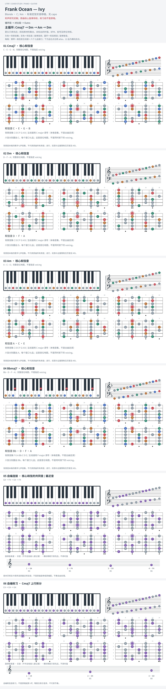

# Frank Ocean — Ivy

- 专辑：Blonde；工作调性：**C / Am**。
- 值得扒：开放和弦与循环旋律。
- 原表：C / Am · A minor（保留追踪，不代表正确）。
- 状态：和声研究初稿；原曲核心旋律待核，练习线不是原唱。

## 结构与进行

循环段 → 对比段 → Outro。

`主循环: Cmaj7 → Dm → Am → Dm`

Bbmaj7/F 来自对比段；卡片展示和弦音集合，斜杠低音 F 需另弹。

## 核心旋律

**待核**：本轮尚未取得并核验逐音主旋律谱；图中自编拆和弦练习不替代原曲核心旋律。

七品 × 六把位；下方品位点；钢琴与高低音五线谱。标准定弦、实音显示。灰色七声音集是本格教学背景，不是整首歌的唯一音阶；彩色点是音位而非同时按下的 voicing。

## 来源与限制

- [参考 1](https://www.reddit.com/r/musictheory/comments/u5fnp5)

按公开谱例/文字分析整理，未声称已听辨原录音或看完视频。没有复制歌词或完整商业谱。
