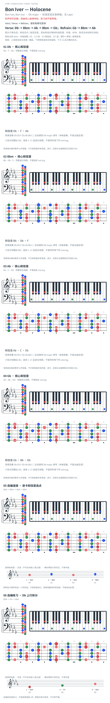

# Bon Iver — Holocene

- 专辑：Bon Iver, Bon Iver；工作调性：**Db major**。
- 值得扒：指弹持续音与和弦更替。
- 状态：和声研究初稿；原曲核心旋律待核，练习线不是原唱。

## 结构与进行

Intro / Verse → Refrain；各轮有尾句变体。

`Verse: Db → Bbm → Ab → Bbm → Gb；Refrain: Gb → Bbm → Ab`

所引标准改编为 capo 1、C 指型；此页统一用 Db 实音，不采用网页自动生成的速度/拍号说明。

## 核心旋律

**待核**：本轮尚未取得并核验逐音主旋律谱；图中自编拆和弦练习不替代原曲核心旋律。

七品 × 六把位；下方品位点；钢琴与高低音五线谱。标准定弦、实音显示。箭头只表先后；和弦名内 / 指定低音，其余斜线分隔材料或段落。时值、BPM、拍号及未标转位待核。灰色七声音集是本格教学背景，不是整首歌的唯一音阶；彩色点是音位而非同时按下的 voicing。

## 来源与限制

- [参考 1](https://ukutabs.com/b/bon-iver/holocene/)
- [参考 2](https://meesterdavidgitaar.wordpress.com/wp-content/uploads/2014/09/holocene-bon-iver-lyrics-and-chords.pdf)

按公开谱例/文字分析整理，未声称已听辨原录音或看完视频。没有复制歌词或完整商业谱。

## 复核记录（2026-10-04）

UkuTabs 标 capo 1，C 版整体升半音支持 Db/Bbm/Ab/Gb；另列 PDF 未逐页重验，指型简谱不证明原配器。

本轮检查了数据、音高/弦品及可取得的引用内容；未逐段听核原录音，发行曲目归属核对不等于录音版本及完整演职员表已核验。图中的自编逐卡选音不保证最短声部连接，卡序不等于原曲进行。

## 曲目信息复核

已对照所列发行曲目表核对主艺人、曲名与所属专辑；不是完整演职员表，也不证明所用谱对应特定录音版本。

- [曲目信息来源 1](https://store.boniver.org/products/bon-iver-bon-iver-lp-us)
