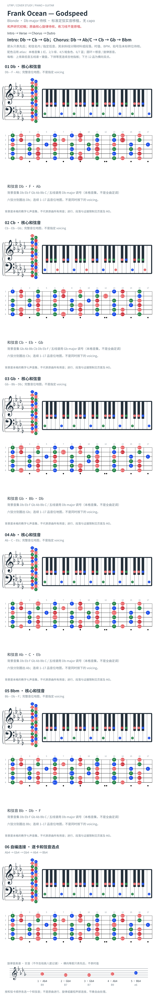

# Frank Ocean — Godspeed

- 专辑：Blonde；工作调性：**Db major 待核**。
- 值得扒：福音终止与借用 bVII。
- 原表：Db / Bbm · Db major（保留追踪，不代表正确）。
- 状态：和声研究初稿；原曲核心旋律待核，练习线不是原唱。

## 结构与进行

Intro → Verse → Chorus → Outro。

`Intro: Db → Cb → Gb；Chorus: Db → Ab/C → Cb → Gb → Bbm`

capo 1 的 C/Bb/F 谱已换算实音；部分出版谱标 Gb，工作中心 Db 依据终止分析，不能称已无争议。

## 核心旋律

**待核**：本轮尚未取得并核验逐音主旋律谱；图中自编拆和弦练习不替代原曲核心旋律。

七品 × 六把位；下方品位点；钢琴与高低音五线谱。标准定弦、实音显示。箭头只表先后；和弦名内 / 指定低音，其余斜线分隔材料或段落。时值、BPM、拍号及未标转位待核。灰色七声音集是本格教学背景，不是整首歌的唯一音阶；彩色点是音位而非同时按下的 voicing。

## 来源与限制

- [参考 1](https://www.guitartabsexplorer.com/ocean-frank/godspeed-chords)
- [参考 2](https://podscripts.co/podcasts/dissect/s3e17-godspeed-futura-free-by-frank-ocean)
- [参考 3](https://www.musicnotes.com/sheetmusic/frank-ocean/godspeed/MN0210504)

按公开谱例/文字分析整理，未声称已听辨原录音或看完视频。没有复制歌词或完整商业谱。

## 复核记录（2026-10-04）

GuitarTabsExplorer capo 1 的 C/G-B/Bb/F/Am 换算与本页对应；其他列举来源未逐一复核，斜杠低音不由根音地图表达。

本轮检查了数据、音高/弦品及可取得的引用内容；未逐段听核原录音，发行曲目归属核对不等于录音版本及完整演职员表已核验。图中的自编逐卡选音不保证最短声部连接，卡序不等于原曲进行。

## 曲目信息复核

已对照所列发行曲目表核对主艺人、曲名与所属专辑；不是完整演职员表，也不证明所用谱对应特定录音版本。

- [曲目信息来源 1](https://music.apple.com/us/album/blonde/1146195596)
