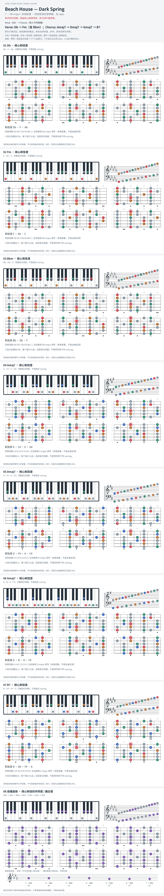

# Beach House — Dark Spring

- 专辑：7；工作调性：**Db major / 多调段落**。
- 值得扒：强烈调域对比。
- 原表：Gb / Ebm · Eb minor（保留追踪，不代表正确）。
- 状态：和声研究初稿；原曲核心旋律待核，练习线不是原唱。

## 结构与进行

Verse（Db）→ Chorus（转入不同音集）。

`Verse: Db → Fm（含 Bbm）；Chorus: Amaj7 → Dmaj7 → Gmaj7 → B7`

原表 Ebm 不符合所引 Verse 谱；依 Verse 归 Db 组，不把 Chorus 的外来和弦误写成调内和弦。

## 核心旋律

**待核**：本轮尚未取得并核验逐音主旋律谱；图中自编拆和弦练习不替代原曲核心旋律。

七品 × 六把位；下方品位点；钢琴与高低音五线谱。标准定弦、实音显示。灰色七声音集是本格教学背景，不是整首歌的唯一音阶；彩色点是音位而非同时按下的 voicing。

## 来源与限制

- [参考 1](https://flypaper.soundfly.com/produce/beach-house-dark-spring-analysis/)
- [参考 2](https://www.hooktheory.com/theorytab/view/beach-house/dark-spring)

按公开谱例/文字分析整理，未声称已听辨原录音或看完视频。没有复制歌词或完整商业谱。
