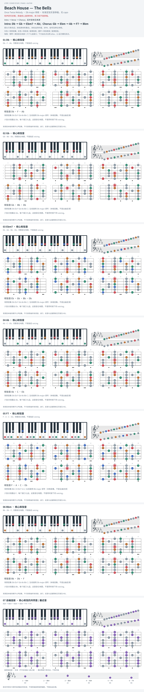

# Beach House — The Bells

- 专辑：Once Twice Melody；工作调性：**Db major 待核**。
- 值得扒：副属和弦通向相对小调。
- 状态：和声研究初稿；原曲核心旋律待核，练习线不是原唱。

## 结构与进行

Intro → Verse → Chorus；后半变体见来源。

`Intro: Db → Gb → Ebm7 → Ab；Chorus: Gb → Ebm → Ab → F7 → Bbm`

据用户扒谱，Chorus 还出现 Gb → Bb → Ebm → Db；精确转位与段落拍数待核。

## 核心旋律

**待核**：本轮尚未取得并核验逐音主旋律谱；图中自编拆和弦练习不替代原曲核心旋律。

七品 × 六把位；下方品位点；钢琴与高低音五线谱。标准定弦、实音显示。灰色七声音集是本格教学背景，不是整首歌的唯一音阶；彩色点是音位而非同时按下的 voicing。

## 来源与限制

- [参考 1](https://www.reddit.com/r/BeachHouse/comments/10ajecn/need_help_finding_piano_chords_for_your_favorite/)

按公开谱例/文字分析整理，未声称已听辨原录音或看完视频。没有复制歌词或完整商业谱。
