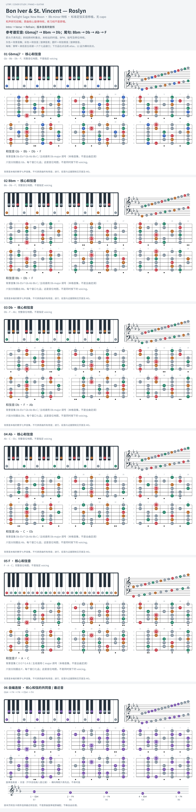

# Bon Iver & St. Vincent — Roslyn

- 专辑：The Twilight Saga: New Moon；工作调性：**Bb minor 待核**。
- 值得扒：小调中的大七和弦与属和弦。
- 状态：和声研究初稿；原曲核心旋律待核，练习线不是原唱。

## 结构与进行

Intro → Verse → Refrain；版本音高待复核。

`参考谱实音: Gbmaj7 → Bbm → Db；尾句: Bbm → Db → Ab → F`

在线简谱为 Am 指型且未写 capo；此版按 Bbm 调性资料上移半音。需对原录音确认，不假称已听核。

## 核心旋律

**待核**：本轮尚未取得并核验逐音主旋律谱；图中自编拆和弦练习不替代原曲核心旋律。

七品 × 六把位；下方品位点；钢琴与高低音五线谱。标准定弦、实音显示。灰色七声音集是本格教学背景，不是整首歌的唯一音阶；彩色点是音位而非同时按下的 voicing。

## 来源与限制

- [参考 1](https://www.e-chords.com/chords/bon-iver/roslyn)
- [参考 2](https://www.hooktheory.com/theorytab/view/bon-iver/roslyn)

按公开谱例/文字分析整理，未声称已听辨原录音或看完视频。没有复制歌词或完整商业谱。
