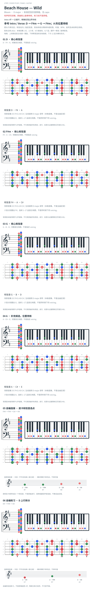

# Beach House — Wild

- 专辑：Bloom；工作调性：**D major**。
- 值得扒：大调 iii 的暗色与吉他 hook。
- 状态：和声研究初稿；原曲核心旋律待核，练习线不是原唱。

## 结构与进行

Intro riff → 主循环；精确段落边界待核。

`参考 Intro / Verse: D → F#m → G → F#m；A 的位置待核`

新增和弦页主循环以 F#m 收尾，不是 A；A 仅保留为待核补充材料，卡序不等于原曲顺序。原 TAB 内文注明降半音定弦，与网页 Standard 标题冲突，不混用弦品。

## 核心旋律

**待核**：本轮尚未取得并核验逐音主旋律谱；图中自编拆和弦练习不替代原曲核心旋律。

七品 × 六把位；下方品位点；钢琴与高低音五线谱。标准定弦、实音显示。箭头只表先后；和弦名内 / 指定低音，其余斜线分隔材料或段落。时值、BPM、拍号及未标转位待核。灰色七声音集是本格教学背景，不是整首歌的唯一音阶；彩色点是音位而非同时按下的 voicing。

## 来源与限制

- [参考 1](https://www.guitartabsexplorer.com/beach-house/wild-tab)
- [参考 2](https://chordify.net/chords/beach-house-wild-beachhousevideozone)

按公开谱例/文字分析整理，未声称已听辨原录音或看完视频。没有复制歌词或完整商业谱。

- [复核补充来源](https://www.guitartabsexplorer.com/pt-br/beach-house/wild-chords)

## 复核记录（2026-10-04）

原 TAB 内文写降半音定弦，与网页自动 Standard 标题冲突；新增和弦页主循环 D/F#m/G/F#m，与旧 D/F#m/G/A 不同。按参考页修正主循环，A 只保留为待核补充材料。

本轮检查了数据、音高/弦品及可取得的引用内容；未逐段听核原录音，发行曲目归属核对不等于录音版本及完整演职员表已核验。图中的自编逐卡选音不保证最短声部连接，卡序不等于原曲进行。

## 曲目信息复核

已对照所列发行曲目表核对主艺人、曲名与所属专辑；不是完整演职员表，也不证明所用谱对应特定录音版本。

- [曲目信息来源 1](https://www.subpop.com/releases/beach_house/bloom)
