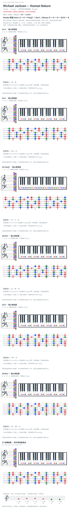

# Michael Jackson — Human Nature

- 专辑：Thriller；工作调性：**D major**。
- 值得扒：借用 bIII 与下行低音。
- 原表：D / Bm · D major（保留追踪，不代表正确）。
- 状态：和声研究初稿；原曲核心旋律待核，练习线不是原唱。

## 结构与进行

Intro → Verse → Chorus → 间奏 → 后续循环。

`8notes 候选 Intro: G → A → Fmaj7 → Em7；Chorus: G → A → D → D/C# → Bm7`

Chorus 后续 A→G→F#m7→Em7；8notes 写 D/C#，Arthur Geurts bass PDF 第 1 页第 14 小节写 A/C#，低音同为 C# 但上方和弦不同，待录音核验。卡片不是原 voicing。

## 核心旋律

**待核**：本轮尚未取得并核验逐音主旋律谱；图中自编拆和弦练习不替代原曲核心旋律。

七品 × 六把位；下方品位点；钢琴与高低音五线谱。标准定弦、实音显示。箭头只表先后；和弦名内 / 指定低音，其余斜线分隔材料或段落。时值、BPM、拍号及未标转位待核。灰色七声音集是本格教学背景，不是整首歌的唯一音阶；彩色点是音位而非同时按下的 voicing。

## 来源与限制

- [参考 1](https://www.8notes.com/video_chords/michael_jackson_human_nature.asp?instrument=harpsichord)
- [参考 2](https://arthurgeurts.com/wp-content/uploads/2020/03/michael-jackson-human-nature-notation.pdf)

按公开谱例/文字分析整理，未声称已听辨原录音或看完视频。没有复制歌词或完整商业谱。

## 复核记录（2026-10-04）

8notes 支持现有简化材料；另视觉核对 Arthur Geurts bass PDF 全 2 页，Chorus 第 14/18/30/34 小节写 A/C# 而非 8notes 的 D/C#。已注明转录冲突，不声称两来源一致；未听核原录音。

本轮检查了数据、音高/弦品及可取得的引用内容；未逐段听核原录音，发行曲目归属核对不等于录音版本及完整演职员表已核验。图中的自编逐卡选音不保证最短声部连接，卡序不等于原曲进行。

## 曲目信息复核

已对照所列发行曲目表核对主艺人、曲名与所属专辑；不是完整演职员表，也不证明所用谱对应特定录音版本。

- [曲目信息来源 1](https://store-uk.michaeljackson.com/products/michael-jackson-thriller-cd?variant=57453612794230)
