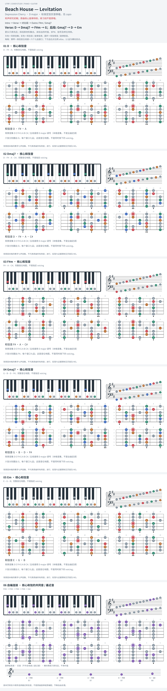

# Beach House — Levitation

- 专辑：Depression Cherry；工作调性：**D major**。
- 值得扒：持续主音与三度声部连接。
- 状态：和声研究初稿；原曲核心旋律待核，练习线不是原唱。

## 结构与进行

Intro → Verse → 对比段 → Outro: F#m / Gmaj7。

`Verse: D → Dmaj7 → F#m → G；后段: Gmaj7 → D → Em`

图保留 D / Dmaj7 的色彩区别；G 与 Gmaj7 并非所有位置都可互换。

## 核心旋律

**待核**：本轮尚未取得并核验逐音主旋律谱；图中自编拆和弦练习不替代原曲核心旋律。

七品 × 六把位；下方品位点；钢琴与高低音五线谱。标准定弦、实音显示。灰色七声音集是本格教学背景，不是整首歌的唯一音阶；彩色点是音位而非同时按下的 voicing。

## 来源与限制

- [参考 1](https://www.e-chords.com/chords/beach-house/levitation)

按公开谱例/文字分析整理，未声称已听辨原录音或看完视频。没有复制歌词或完整商业谱。
