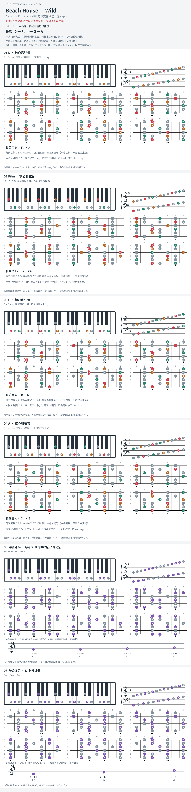

# Beach House — Wild

- 专辑：Bloom；工作调性：**D major**。
- 值得扒：大调 iii 的暗色与吉他 hook。
- 状态：和声研究初稿；原曲核心旋律待核，练习线不是原唱。

## 结构与进行

Intro riff → 主循环；精确段落边界待核。

`骨架: D → F#m → G → A`

和声为候选骨架；吉他线请对照原 TAB，不把整曲简化为均分四和弦。

## 核心旋律

**待核**：本轮尚未取得并核验逐音主旋律谱；图中自编拆和弦练习不替代原曲核心旋律。

七品 × 六把位；下方品位点；钢琴与高低音五线谱。标准定弦、实音显示。灰色七声音集是本格教学背景，不是整首歌的唯一音阶；彩色点是音位而非同时按下的 voicing。

## 来源与限制

- [参考 1](https://www.guitartabsexplorer.com/beach-house/wild-tab)
- [参考 2](https://chordify.net/chords/beach-house-wild-beachhousevideozone)

按公开谱例/文字分析整理，未声称已听辨原录音或看完视频。没有复制歌词或完整商业谱。
