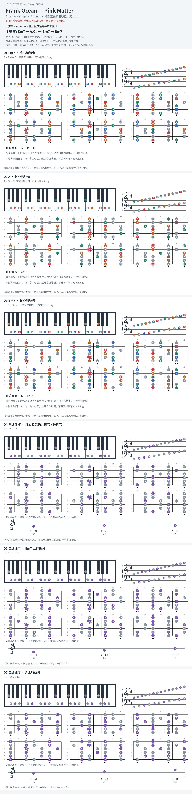

# Frank Ocean — Pink Matter

- 专辑：Channel Orange；工作调性：**B minor**。
- 值得扒：ii–V 色彩与小调落点。
- 原表：D / Bm · B minor（保留追踪，不代表正确）。
- 状态：和声研究初稿；原曲核心旋律待核，练习线不是原唱。

## 结构与进行

人声段 / André 3000 段；段落边界待录音核对。

`主循环: Em7 → A/C# → Bm7 → Bm7`

采用翻弹者的 A/C# 版本；图中 A 卡不表示根音低音，请另保留 C# bass。

## 核心旋律

**待核**：本轮尚未取得并核验逐音主旋律谱；图中自编拆和弦练习不替代原曲核心旋律。

七品 × 六把位；下方品位点；钢琴与高低音五线谱。标准定弦、实音显示。灰色七声音集是本格教学背景，不是整首歌的唯一音阶；彩色点是音位而非同时按下的 voicing。

## 来源与限制

- [参考 1](https://www.reddit.com/r/FrankOcean/comments/1750oas)
- [参考 2](https://www.chords-and-tabs.net/song/name/frank-ocean-pink-matter)

按公开谱例/文字分析整理，未声称已听辨原录音或看完视频。没有复制歌词或完整商业谱。
