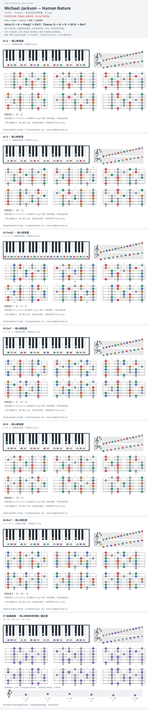

# Michael Jackson — Human Nature

- 专辑：Thriller；工作调性：**D major**。
- 值得扒：借用 bIII 与下行低音。
- 原表：D / Bm · D major（保留追踪，不代表正确）。
- 状态：和声研究初稿；原曲核心旋律待核，练习线不是原唱。

## 结构与进行

Intro → Verse → Chorus → 间奏 → 后续循环。

`Intro: G → A → Fmaj7 → Em7；Chorus: G → A → D → D/C# → Bm7`

Chorus 后续 A → G → F#m7 → Em7；卡片不是原录音 voicing 的逐音转录。

## 核心旋律

**待核**：本轮尚未取得并核验逐音主旋律谱；图中自编拆和弦练习不替代原曲核心旋律。

七品 × 六把位；下方品位点；钢琴与高低音五线谱。标准定弦、实音显示。灰色七声音集是本格教学背景，不是整首歌的唯一音阶；彩色点是音位而非同时按下的 voicing。

## 来源与限制

- [参考 1](https://www.8notes.com/video_chords/michael_jackson_human_nature.asp?instrument=harpsichord)
- [参考 2](https://arthurgeurts.com/wp-content/uploads/2020/03/michael-jackson-human-nature-notation.pdf)

按公开谱例/文字分析整理，未声称已听辨原录音或看完视频。没有复制歌词或完整商业谱。
