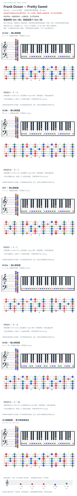

# Frank Ocean — Pretty Sweet

- 专辑：Blonde；工作调性：**D minor 待核**。
- 值得扒：半音和声与织体转变。
- 原表：F / Dm · D minor（保留追踪，不代表正确）。
- 状态：候选和声仅据自动识别/教学资料，非人工定稿；原曲核心旋律待核，练习线不是原唱。

## 结构与进行

前段声墙 → 速度感改变 → 合唱收束；正式节拍待核。

`候选材料: Dm / Bb；后段出现 F / Em / Eb`

机器和弦仅供核对，斜线表示材料集合而非确定循环；不得把每个和弦等时循环当成原曲。

## 核心旋律

**待核**：本轮尚未取得并核验逐音主旋律谱；图中自编拆和弦练习不替代原曲核心旋律。

七品 × 六把位；下方品位点；钢琴与高低音五线谱。标准定弦、实音显示。箭头只表先后；和弦名内 / 指定低音，其余斜线分隔材料或段落。时值、BPM、拍号及未标转位待核。灰色七声音集是本格教学背景，不是整首歌的唯一音阶；彩色点是音位而非同时按下的 voicing。

## 来源与限制

- [参考 1](https://chordu.com/chords-tabs-frank-ocean-pretty-sweet-id_HWDaIRe8_XI)

按公开谱例/文字分析整理，未声称已听辨原录音或看完视频。没有复制歌词或完整商业谱。

## 复核记录（2026-10-04）

ChordU 仅支持 Dm/Bb/F/Em/Eb 等候选材料；自动页面不能证明它们的先后、时值或调性中心，未填写虚构固定循环。

本轮检查了数据、音高/弦品及可取得的引用内容；未逐段听核原录音，发行曲目归属核对不等于录音版本及完整演职员表已核验。图中的自编逐卡选音不保证最短声部连接，卡序不等于原曲进行。

## 曲目信息复核

已对照所列发行曲目表核对主艺人、曲名与所属专辑；不是完整演职员表，也不证明所用谱对应特定录音版本。

- [曲目信息来源 1](https://music.apple.com/us/album/blonde/1146195596)
