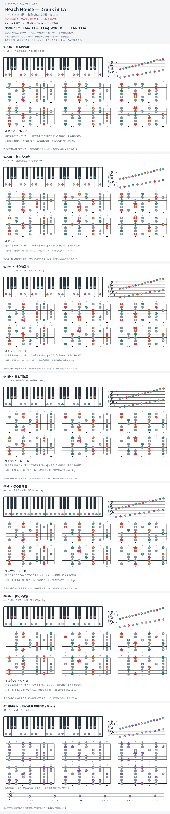

# Beach House — Drunk in LA

- 专辑：7；工作调性：**C minor 待核**。
- 值得扒：小调和弦之间的共通音。
- 原表：Eb / Cm · C minor（保留追踪，不代表正确）。
- 状态：和声研究初稿；原曲核心旋律待核，练习线不是原唱。

## 结构与进行

Intro → 主循环与对比段交替 → Outro；小节长度待核。

`主循环: Cm → Gm → Fm → Cm；对比: Eb → G → Ab → Cm`

依 GuitarTuna 所列 Cm 简化谱；页面同时标 Capo 3，实音/指型语义需对录音复核。本图先按所写和弦作无 capo 实音探索，不再叠加移调；G major 的 B 是小调借用音。

## 核心旋律

**待核**：本轮尚未取得并核验逐音主旋律谱；图中自编拆和弦练习不替代原曲核心旋律。

七品 × 六把位；下方品位点；钢琴与高低音五线谱。标准定弦、实音显示。灰色七声音集是本格教学背景，不是整首歌的唯一音阶；彩色点是音位而非同时按下的 voicing。

## 来源与限制

- [参考 1](https://guitartuna.com/chords/drunk-in-la-beach-house-easy-guitar-chords-6739aaa709eeaaddce2ef6b0)
- [参考 2](https://chordu.com/chords-tabs-beach-house-drunk-in-la--id_M0vMIQLXxqQ)

按公开谱例/文字分析整理，未声称已听辨原录音或看完视频。没有复制歌词或完整商业谱。
