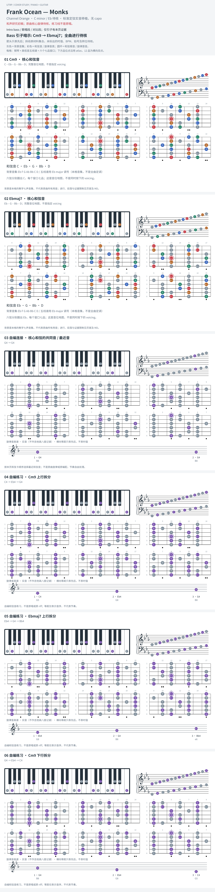

# Frank Ocean — Monks

- 专辑：Channel Orange；工作调性：**C minor / Eb 待核**。
- 值得扒：九和弦琶音与共同音。
- 原表：Bb / Gm · G minor（保留追踪，不代表正确）。
- 状态：和声研究初稿；原曲核心旋律待核，练习线不是原唱。

## 结构与进行

Intro bass / 歌唱段 / 对比段；仅引子有本页证据。

`Bass 引子暗示: Cm9 → Ebmaj7；全曲进行待核`

原表 Gm 待纠正；从 bass 音列推断 Cm9 / Ebmaj7，不把此推断推广为全曲伴奏。先存档，不挤占五席。

## 核心旋律

**待核**：本轮尚未取得并核验逐音主旋律谱；图中自编拆和弦练习不替代原曲核心旋律。

七品 × 六把位；下方品位点；钢琴与高低音五线谱。标准定弦、实音显示。灰色七声音集是本格教学背景，不是整首歌的唯一音阶；彩色点是音位而非同时按下的 voicing。

## 来源与限制

- [参考 1](https://www.chords-and-tabs.net/song/name/frank-ocean-monks)

按公开谱例/文字分析整理，未声称已听辨原录音或看完视频。没有复制歌词或完整商业谱。
