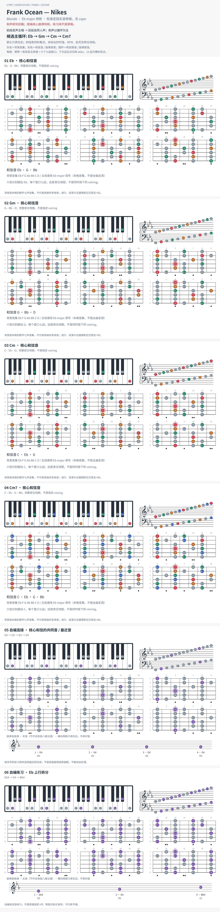

# Frank Ocean — Nikes

- 专辑：Blonde；工作调性：**Eb major 待核**。
- 值得扒：同调内主音与相对小调的重心变化。
- 原表：Ab / Fm · Ab major（保留追踪，不代表正确）。
- 状态：和声研究初稿；原曲核心旋律待核，练习线不是原唱。

## 结构与进行

前段变声主唱 → 后段自然人声；和声以循环为主。

`候选主循环: Eb → Gm → Cm → Cm7`

参考页 capo 3 与已写成 Eb 的和弦并列，不能再升三半音；录音实音待复核，原表 Ab 不沿用。

## 核心旋律

**待核**：本轮尚未取得并核验逐音主旋律谱；图中自编拆和弦练习不替代原曲核心旋律。

七品 × 六把位；下方品位点；钢琴与高低音五线谱。标准定弦、实音显示。灰色七声音集是本格教学背景，不是整首歌的唯一音阶；彩色点是音位而非同时按下的 voicing。

## 来源与限制

- [参考 1](https://www.e-chords.com/chords/frank-ocean/nikes)

按公开谱例/文字分析整理，未声称已听辨原录音或看完视频。没有复制歌词或完整商业谱。
