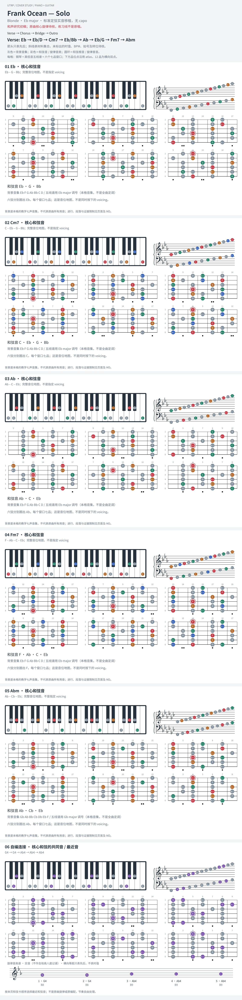

# Frank Ocean — Solo

- 专辑：Blonde；工作调性：**Eb major**。
- 值得扒：下行 bass 与借用小 iv。
- 原表：Ab / Fm · F minor（保留追踪，不代表正确）。
- 状态：和声研究初稿；原曲核心旋律待核，练习线不是原唱。

## 结构与进行

Verse → Chorus → Bridge → Outro。

`Verse: Eb → Eb/D → Cm7 → Eb/Bb → Ab → Eb/G → Fm7 → Abm`

capo 3 的 C 指型已换算 Eb 实音；原表 Fm 是把局部和弦当成主调。

## 核心旋律

**待核**：本轮尚未取得并核验逐音主旋律谱；图中自编拆和弦练习不替代原曲核心旋律。

七品 × 六把位；下方品位点；钢琴与高低音五线谱。标准定弦、实音显示。灰色七声音集是本格教学背景，不是整首歌的唯一音阶；彩色点是音位而非同时按下的 voicing。

## 来源与限制

- [参考 1](https://www.chords-and-tabs.net/song/name/frank-ocean-solo)

按公开谱例/文字分析整理，未声称已听辨原录音或看完视频。没有复制歌词或完整商业谱。
