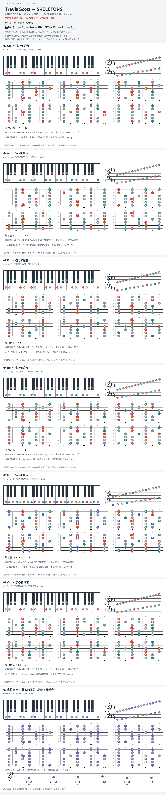

# Travis Scott — SKELETONS

- 专辑：ASTROWORLD；工作调性：**C minor 待核**。
- 值得扒：自然小调与属七的对比。
- 原表：Eb / Cm · C minor（保留追踪，不代表正确）。
- 状态：和声研究初稿；原曲核心旋律待核，练习线不是原唱。

## 结构与进行

两个循环变体；段落边界待核。

`循环: Gm → Ab → Fm → Bb；G7 → Cm → Fm → Bb`

参考谱对 C7 / Cm 存在差异；此版用 Cm 候选，不称已完整核对录音。

## 核心旋律

**待核**：本轮尚未取得并核验逐音主旋律谱；图中自编拆和弦练习不替代原曲核心旋律。

七品 × 六把位；下方品位点；钢琴与高低音五线谱。标准定弦、实音显示。灰色七声音集是本格教学背景，不是整首歌的唯一音阶；彩色点是音位而非同时按下的 voicing。

## 来源与限制

- [参考 1](https://www.chords-and-tabs.net/song/name/travis-scott-skeletons)
- [参考 2](https://www.youtube.com/watch?v=LVzth3e53Io)

按公开谱例/文字分析整理，未声称已听辨原录音或看完视频。没有复制歌词或完整商业谱。
