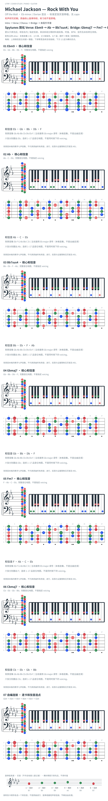

# Michael Jackson — Rock With You

- 专辑：Off the Wall；工作调性：**Eb minor / Dorian 混合**。
- 值得扒：Dorian 的大 IV 与跨调桥段。
- 原表：Db / Bbm · Db major（保留追踪，不代表正确）。
- 状态：和声研究初稿；原曲核心旋律待核，练习线不是原唱。

## 结构与进行

Intro → Verse / Chorus → Bridge → 末段升半音。

`Spytunes 简化 Verse: Ebm9 → Ab → Bb7sus4；Bridge: Gbmaj7 → Fm7 → Cbmaj7 → Ab11`

按 Spytunes 简化与段落命名；其 Bridge 对应 Ottenberg PDF 的 Pre-Chorus。Bb11 省九音为 Bb7sus4；PDF 另写 Ebm9/Ab、Ab/Bb、Dbmaj7/F、Cbmaj9、Gb/Ab，和声层次有差异。末段升至 Em，未在卡片展开。

## 核心旋律

**待核**：本轮尚未取得并核验逐音主旋律谱；图中自编拆和弦练习不替代原曲核心旋律。

七品 × 六把位；下方品位点；钢琴与高低音五线谱。标准定弦、实音显示。箭头只表先后；和弦名内 / 指定低音，其余斜线分隔材料或段落。时值、BPM、拍号及未标转位待核。灰色七声音集是本格教学背景，不是整首歌的唯一音阶；彩色点是音位而非同时按下的 voicing。

## 来源与限制

- [参考 1](https://spytunes.com/rock-with-you-chords/)
- [参考 2](https://www.markusottenberg.de/downloads/Rock-With-You-Michael-Jackson.pdf)

按公开谱例/文字分析整理，未声称已听辨原录音或看完视频。没有复制歌词或完整商业谱。

## 复核记录（2026-10-04）

Spytunes 支持本页简化材料；已视觉检查 Ottenberg PDF 全 5 页，其第 1 页第 10/18 小节包含不同 slash chord/延伸，Dbmaj7/F 与 Fm7 音集合不同。PDF 将第 18 小节称 Pre-Chorus、第 58 小节称 Bridge，与 Spytunes 段落命名不同；第 4 页第 82 小节 Em9 支持末段升半音。未听核原录音。

本轮检查了数据、音高/弦品及可取得的引用内容；未逐段听核原录音，发行曲目归属核对不等于录音版本及完整演职员表已核验。图中的自编逐卡选音不保证最短声部连接，卡序不等于原曲进行。

## 曲目信息复核

已对照所列发行曲目表核对主艺人、曲名与所属专辑；不是完整演职员表，也不证明所用谱对应特定录音版本。

- [曲目信息来源 1](https://www.michaeljackson.com/albums/off-the-wall/)
