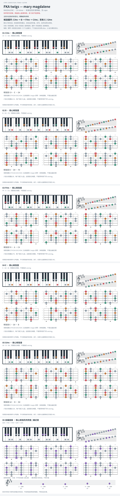

# FKA twigs — mary magdalene

- 专辑：MAGDALENE；工作调性：**C# minor**。
- 值得扒：小调七九度色彩与多声部交叠。
- 原表：E / C#m · C# minor（保留追踪，不代表正确）。
- 状态：和声研究初稿；原曲核心旋律待核，练习线不是原唱。

## 结构与进行

主段与后段织体变化；精确结构待核。

`候选循环: C#m → B → F#m → C#m；另有 E / G#m`

调性有独立分析支持；逐处 7th / 9th 未核实，先画三和弦骨架，不凭空给每个和弦加七度。

## 核心旋律

**待核**：本轮尚未取得并核验逐音主旋律谱；图中自编拆和弦练习不替代原曲核心旋律。

七品 × 六把位；下方品位点；钢琴与高低音五线谱。标准定弦、实音显示。灰色七声音集是本格教学背景，不是整首歌的唯一音阶；彩色点是音位而非同时按下的 voicing。

## 来源与限制

- [参考 1](https://www.reddit.com/r/musictheory/comments/jn832m)
- [参考 2](https://chordu.com/chords-tabs-fka-twigs-mary-magdalene-official-audio--id_6W5znLCToKU)

按公开谱例/文字分析整理，未声称已听辨原录音或看完视频。没有复制歌词或完整商业谱。
