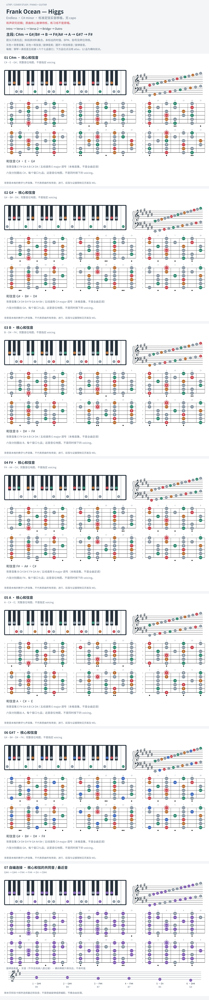

# Frank Ocean — Higgs

- 专辑：Endless；工作调性：**C# minor**。
- 值得扒：半音下行 bass 与借用大 IV。
- 原表：B / G#m · B major（保留追踪，不代表正确）。
- 状态：和声研究初稿；原曲核心旋律待核，练习线不是原唱。

## 结构与进行

Intro → Verse 1 → Verse 2 → Bridge → Outro。

`主段: C#m → G#/B# → B → F#/A# → A → G#7 → F#`

原表 B 改为 C#m；参考谱 G#/C 规范为 G#/B#。卡片个别采用等音拼写避免双升号。

## 核心旋律

**待核**：本轮尚未取得并核验逐音主旋律谱；图中自编拆和弦练习不替代原曲核心旋律。

七品 × 六把位；下方品位点；钢琴与高低音五线谱。标准定弦、实音显示。灰色七声音集是本格教学背景，不是整首歌的唯一音阶；彩色点是音位而非同时按下的 voicing。

## 来源与限制

- [参考 1](https://www.e-chords.com/chords/frank-ocean/higgs)

按公开谱例/文字分析整理，未声称已听辨原录音或看完视频。没有复制歌词或完整商业谱。
