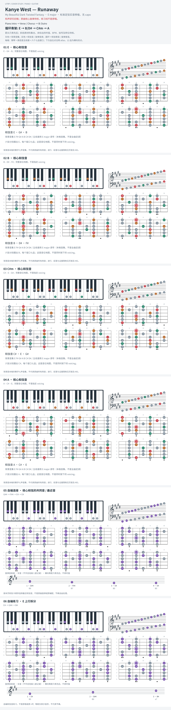

# Kanye West — Runaway

- 专辑：My Beautiful Dark Twisted Fantasy；工作调性：**E major**。
- 值得扒：固定高音动机与下行 bass。
- 原表：E / C#m · E major（保留追踪，不代表正确）。
- 状态：和声研究初稿；原曲核心旋律待核，练习线不是原唱。

## 结构与进行

Piano intro → Verse / Chorus → 长 Outro。

`循环骨架: E → B/D# → C#m → A`

B/D# 与 D#m 有网络转录分歧；采用前者分析版，bass 的 D# 与上层和弦分开练。

## 核心旋律

**待核**：本轮尚未取得并核验逐音主旋律谱；图中自编拆和弦练习不替代原曲核心旋律。

七品 × 六把位；下方品位点；钢琴与高低音五线谱。标准定弦、实音显示。灰色七声音集是本格教学背景，不是整首歌的唯一音阶；彩色点是音位而非同时按下的 voicing。

## 来源与限制

- [参考 1](https://www.reddit.com/r/pianolearning/comments/rsx83o)
- [参考 2](https://www.reddit.com/r/Kanye/comments/sximuo)
- [参考 3](https://blogs.bu.edu/rpt/files/2016/07/Kanye-West-Runaway.pdf)

按公开谱例/文字分析整理，未声称已听辨原录音或看完视频。没有复制歌词或完整商业谱。
