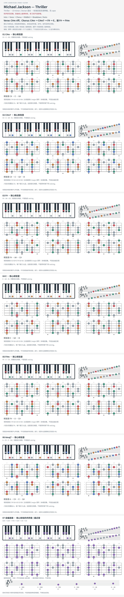

# Michael Jackson — Thriller

- 专辑：Thriller；工作调性：**C# minor / Dorian 混合**。
- 值得扒：大 IV / 小 iv 的调式色彩切换。
- 原表：E / C#m · C# minor（保留追踪，不代表正确）。
- 状态：和声研究初稿；原曲核心旋律待核，练习线不是原唱。

## 结构与进行

Intro → Verse → Chorus → Middle 8 → Breakdown / Outro。

`Verse: C#m riff；Chorus: C#m → C#m7 → F# → E，接 F# → F#m`

Middle 8 另有 C#m/B → A#m7b5 → Amaj7 → G#sus4 → G#；图只取核心和弦，不是完整总谱。

## 核心旋律

**待核**：本轮尚未取得并核验逐音主旋律谱；图中自编拆和弦练习不替代原曲核心旋律。

七品 × 六把位；下方品位点；钢琴与高低音五线谱。标准定弦、实音显示。灰色七声音集是本格教学背景，不是整首歌的唯一音阶；彩色点是音位而非同时按下的 voicing。

## 来源与限制

- [参考 1](https://spytunes.com/thriller-chords/)

按公开谱例/文字分析整理，未声称已听辨原录音或看完视频。没有复制歌词或完整商业谱。
