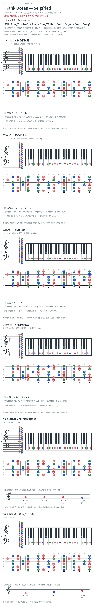

# Frank Ocean — Seigfried

- 专辑：Blonde；工作调性：**E minor / 混合音集**。
- 值得扒：大七色彩与自然六级混用。
- 原表：G / Em · E minor（保留追踪，不代表正确）。
- 状态：和声研究初稿；原曲核心旋律待核，练习线不是原唱。

## 结构与进行

Intro → 主段 → Rap → Outro。

`主段: Cmaj7 → Am9 → Em → Dmaj7；Rap: Em → Em/A → Em → Dmaj7`

Dmaj7 包含 C#，与 Cmaj7 的 C natural 分属不同局部音集；不能用一张 Em 自然小调图概括。

## 核心旋律

**待核**：本轮尚未取得并核验逐音主旋律谱；图中自编拆和弦练习不替代原曲核心旋律。

七品 × 六把位；下方品位点；钢琴与高低音五线谱。标准定弦、实音显示。箭头只表先后；和弦名内 / 指定低音，其余斜线分隔材料或段落。时值、BPM、拍号及未标转位待核。灰色七声音集是本格教学背景，不是整首歌的唯一音阶；彩色点是音位而非同时按下的 voicing。

## 来源与限制

- [参考 1](https://www.e-chords.com/chords/frank-ocean/seigfried)

按公开谱例/文字分析整理，未声称已听辨原录音或看完视频。没有复制歌词或完整商业谱。

## 复核记录（2026-10-04）

E-Chords 支持 Cmaj7/Am9/Em/Dmaj7 及 Em-A 的材料；Dmaj7 的 C# 是 E 小调外的音，七声音集仅分格教学背景。

本轮检查了数据、音高/弦品及可取得的引用内容；未逐段听核原录音，发行曲目归属核对不等于录音版本及完整演职员表已核验。图中的自编逐卡选音不保证最短声部连接，卡序不等于原曲进行。

## 曲目信息复核

已对照所列发行曲目表核对主艺人、曲名与所属专辑；不是完整演职员表，也不证明所用谱对应特定录音版本。

- [曲目信息来源 1](https://music.apple.com/us/album/blonde/1146195596)
