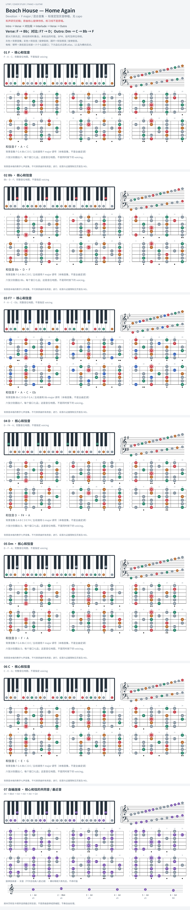

# Beach House — Home Again

- 专辑：Devotion；工作调性：**F major / 混合音集**。
- 值得扒：大 VI / 小 vi 的对照。
- 状态：和声研究初稿；原曲核心旋律待核，练习线不是原唱。

## 结构与进行

Intro → Verse → 对比段 → Interlude → Verse → Outro。

`Verse: F → Bb；对比: F7 → D；Outro: Dm → C → Bb → F`

D 大和弦与 Dm 在不同段落出现，不是排版错误；色彩音 F# 需与 F natural 分开听。

## 核心旋律

**待核**：本轮尚未取得并核验逐音主旋律谱；图中自编拆和弦练习不替代原曲核心旋律。

七品 × 六把位；下方品位点；钢琴与高低音五线谱。标准定弦、实音显示。灰色七声音集是本格教学背景，不是整首歌的唯一音阶；彩色点是音位而非同时按下的 voicing。

## 来源与限制

- [参考 1](https://www.e-chords.com/chords/beach-house/home-again)

按公开谱例/文字分析整理，未声称已听辨原录音或看完视频。没有复制歌词或完整商业谱。
